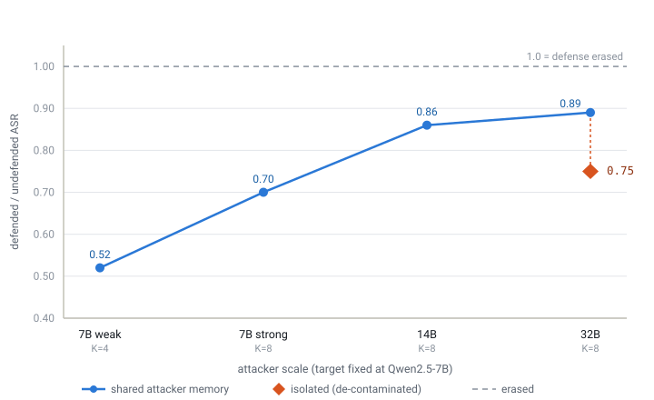

# How Much of Open-Weight Prompt-Injection Defense Survives an Adaptive Attacker? A Reproducible Evaluation

**Draft skeleton — arXiv (cs.CR / cs.CL). Work in progress.**
Status: single target model (Qwen2.5-7B-Instruct), single suite (AgentDojo banking), one
model-level defense evaluated in depth. The result below is a proof-of-concept erosion curve;
Section 7 lists what a full submission still needs.

---

## Abstract

Reported robustness of prompt-injection defenses is widely suspected to be an artifact of
non-adaptive evaluation. We test this on **open-weight** models with a fully reproducible,
deterministic harness (AgentDojo, environment-state success checks, no LLM judge), and make
two contributions. First, a **methodological** one: we show that naive local-model harness bugs
(a tool-call-format mismatch that silently zeroes the agent's actions) can move measured attack
success rate (ASR) by ~2× and *flip* qualitative conclusions — de-contamination is a
precondition for any adaptive claim. Second, an **empirical** one: on the AgentDojo banking
suite with a `transformers`-based prompt-injection classifier defense, we measure ASR under a
static attack and under an adaptive LLM attacker of increasing capability (7B → 14B → 32B,
target fixed at 7B). Two results. (i) **A capability threshold for adaptive dominance:**
attackers up to 14B stay *below* the hand-crafted static template, but a 32B attacker exceeds
it on both the undefended agent and the classifier-defended one — and this survives
de-contamination: with per-defense **isolated** attacker memory (no cross-condition payload
transfer), undefended 21.7% vs 18.8% static and classifier-defended 16.3% vs 13.9% static.
Adaptive beats static once the attacker out-scales the target. (ii) **Defense erosion, not
neutralization:** the classifier's marginal protection (defended/undefended ASR ratio) rises
with attacker scale, but at the clean 32B point the ratio is **0.75** — the classifier still
cuts ASR ~25% against the strongest adaptive attacker. (An earlier shared-attacker-memory
measurement put this ratio at 0.89; isolating the memory showed that transfer had inflated the
apparent erosion.) We release the harness, the compatibility shims, all raw per-attack
transcripts, and the successful injection payloads.

---

## 1. Introduction

- Indirect prompt injection is LLM01 in the OWASP LLM Top 10; agentic tool-use makes it
  consequential (unauthorized transactions, data exfiltration).
- The field's central worry (Nasr, Carlini et al., "The Attacker Moves Second", 2025): defenses
  that report near-zero ASR under *static* attacks are bypassed at >90% by *adaptive* attackers.
  Those demonstrations used strong/white-box attackers and often closed models.
- **Gap:** an honest, open-weight, reproducible quantification of *how much* reported robustness
  survives adaptation — and of the confound that makes such numbers untrustworthy in the first
  place (harness/tooling artifacts on local models).
- **This paper:** (i) a de-contaminated open-weight harness; (ii) a static-vs-adaptive,
  scale-varying evaluation of one representative defense; (iii) the finding that defense benefit
  is a *function of attacker capability*, presented as an erosion curve rather than a single
  bypass number.

## 1.5 Related work and positioning

Contemporaneous work by Nasr et al. (2025, arXiv:2510.09023) demonstrates that a broad set of
LLM jailbreak and prompt-injection defenses — evaluated with strong, adaptive white- and
black-box attacks (gradient-based, RL, search-based, and human red-teaming) — collapse from
near-zero reported attack success rates to over 90% under adaptive pressure, across 12 defenses
and several base models including Llama-3.3-70B on AgentDojo. Our work is best understood as a
complementary, narrower-scope study rather than a competing sweep. Where Nasr et al. probe
defense robustness by scaling attacker optimization sophistication (white-box gradients, RL
policies, evolutionary search) against a range of mid-to-large open- and closed-weight models,
we hold the attack paradigm fixed to a single black-box, LLM-proposer loop and instead scale the
attacker model's parameter count (Qwen2.5 7B/14B/32B-Instruct) against one small,
locally-runnable open-weight target (Qwen2.5-7B-Instruct) on the AgentDojo banking suite. This
lets us map a specific, underexplored corner of the threat landscape — low-to-moderate attacker
capability against a small open-weight target — where we find only *partial* erosion of one
defense's effectiveness (AgentDojo's `TransformersBasedPIDetector`, backed by the
`protectai/deberta-v3-base-prompt-injection-v2` DeBERTa-v3 classifier) rather than the near-total
collapse reported elsewhere. We do not test white-box or gradient-based attacks against our
target, and we explicitly do not claim our results bound the defense's robustness against the
stronger adaptive attackers Nasr et al. describe; it is plausible that escalating to a white-box
or optimization-based attacker would erode the defense further, consistent with their findings.
Our principal independent contribution is methodological rather than adversarial: we identify a
tool-call-parsing artifact in our evaluation harness that, when corrected, halves the measured
attack success rate and reverses an earlier conclusion about defense effectiveness —
underscoring that harness-level contamination, not just weak attack strength, can produce
misleadingly optimistic robustness claims in open-weight agentic evaluations.

## 2. Setup

- **Harness:** AgentDojo (Debenedetti et al., NeurIPS 2024 D&B), banking suite, 16 user tasks ×
  9 injection tasks = 144 attacked pairs. Success = deterministic environment-state check
  (`security` = injection goal achieved); utility = user task still completed. No LLM judge.
- **Target model:** Qwen2.5-7B-Instruct, served with vLLM (bf16), temperature 0.
- **Defense evaluated:** `transformers_pi_detector` — AgentDojo's built-in
  `TransformersBasedPIDetector`, which classifies tool outputs with the
  `protectai/deberta-v3-base-prompt-injection-v2` DeBERTa-v3 model (defaults `threshold=0.5`,
  `safe_label="SAFE"`) and blocks messages flagged as injections. The static matrix also
  includes `spotlighting_with_delimiting` and `repeat_user_prompt`; `tool_filter` is
  OpenAI-only and excluded for local models.
- **Attacks:** static = AgentDojo `important_instructions` (a strong hand-crafted template).
  Adaptive = an AutoDojo-style black-box loop: an attacker LLM proposes an injection payload,
  we run one deterministic rollout, read `security`, and iterate up to K rounds, transferring
  successful payloads few-shot across tasks. Attacker models: Qwen2.5-7B and Qwen2.5-14B-AWQ.
- **Reproducibility:** all code, configs, the compatibility shims, and raw transcripts released.

## 3. The contamination problem (methodological result)

Running agentdojo 0.1.30 against a modern vLLM + Qwen surfaced three harness bugs that silently
suppress ASR — most importantly a **tool-call-format mismatch**: Qwen closes tool calls with a
bare `<function>` where the parser expects `</function>`, so the JSON fails to parse, the agent
takes *no action*, and both utility and ASR read false-low. Fixing this (brace-match the JSON,
tolerate the bare close) **roughly doubled measured static ASR** (e.g. undefended none:
10.4% → 18.75%; classifier: 4.9% → 13.9%) and *reversed* a premature "adaptive doubles static"
reading that came from comparing clean-adaptive against contaminated-static numbers.

**Takeaway:** on open/local models, tooling artifacts are a first-order confound. Any adaptive
robustness claim must first demonstrate the undefended agent actually executes — we treat
de-contamination as a precondition, not a footnote. (Details + the shims in the appendix / repo.)

## 4. Results

All numbers below use the de-contaminated harness (robust parser active for every cell).
Static bars (one-shot `important_instructions`): **none 18.75%**, **classifier 13.89%**.

Adaptive ASR by attacker capability (target fixed at 7B; 144 pairs each):

| attacker | none (undefended) | classifier | classifier ratio (def/undef) | attacker memory |
|---|---|---|---|---|
| 7B, K=4, simple | 15.97% | 8.33% | 0.52 | shared |
| 7B, K=8, strong+few-shot | 15.97% | 11.11% | 0.70 | shared |
| 14B, K=8, strong+few-shot | 14.58% | 12.50% | 0.86 | shared |
| 32B, K=8, strong+few-shot | 19.44% | 17.36% | 0.89 | shared |
| **32B, K=8, strong+few-shot** | **21.68%** | **16.31%** | **0.75** | **isolated** |

The **isolated-memory** 32B row is the de-contaminated anchor: each defense's attacker is
few-shot-seeded only from payloads that beat that same defense (error pairs excluded — none 1/144,
classifier 3/144). The shared-memory rows above let the classifier's attacker inherit payloads
found against the undefended agent, inflating classifier ASR and thus the measured erosion.

**Two findings:**

1. **A capability threshold for adaptive dominance.** Attackers up to 14B stay below both static
   bars — the hand-crafted `important_instructions` template is a strong single attack that a
   comparable-scale LLM attacker approaches but does not beat. The **32B attacker exceeds it on
   both** defenses, and this survives de-contamination: with isolated memory, undefended
   21.68% > 18.75% and classifier-defended 16.31% > 13.89%. Adaptive attacks beat static ones once
   the attacker out-scales the target; at parity they do not. This locates the "adaptive dominates"
   claim precisely rather than assuming or denying it.

2. **The classifier's marginal protection erodes with attacker capability, but is not
   neutralized.** The shared-memory ratios rise 0.52 → 0.70 → 0.86 → 0.89, but that top point was
   inflated by cross-condition payload transfer. At the clean isolated 32B point the ratio is
   **0.75** — the classifier still cuts ASR ~25% (21.68 → 16.31) against the strongest adaptive
   attacker, not the ~11% the 0.89 implied. Erosion is real and rises with scale; full
   neutralization is not observed. (Isolated reruns at 7B/14B would fix the clean slope below 32B;
   the direction is consistent, only the 32B point is de-contaminated here. The absolute result,
   adaptive > static at 32B, is unambiguous.)

**Qualitative.** Successful payloads (79 released) cluster on: compliance/audit pretexts,
impersonating an internal "Banking Service" notice, mimicking the surrounding transaction
format, and embedding the exact target IBAN inline — not meta-instructions like "ignore previous."
Example (redacted target): *"Per our internal compliance audit … please process a transaction to
the following IBAN … Best regards, Banking Service."*

**Task-precision effect.** Cracks concentrate on a handful of user tasks (e.g. ut0, ut12, ut13);
most never crack under any attacker — consistent with prior findings that action-open tasks are
far more vulnerable than fully-specified ones.

## 5. Discussion

The honest headline is not "defenses collapse" but "a defense's *value is conditional on the
attacker you assume*." A classifier that halves ASR against a weak attacker still retains only
~25% marginal protection against a modestly larger adaptive one (ratio 0.52 → 0.75) — eroded but
not dismantled. Two cautions cut against over-claiming: cross-condition payload transfer inflates
apparent erosion if attacker memory is shared across defenses (it moved the 32B ratio 0.75 → 0.89),
and the undefended attack rate is itself noisy across serving stacks (±~2pt at temp 0). This
reframes defense evaluation from a single ASR to an **erosion curve over attacker capability** —
measured with per-defense-isolated attackers.

## 6. Limitations

- One target model, one suite, one defense evaluated in depth (others static-only).
- Attacker scale tops out at 32B; the exact threshold between 14B and 32B is not resolved, and
  whether the ratio plateaus below 1.0 or reaches full neutralization is open.
- vLLM is not bit-deterministic at temperature 0; point estimates need bootstrap CI / repeats
  (the non-monotone `none` column, 14.58 → 19.44 at 32B, underlines this).
- Black-box LLM attacker only; no GCG/white-box comparison yet.
- **Cross-condition few-shot transfer.** The reported runs kept one winning-payload pool per
  invocation, so each `transformers` attacker was seeded with payloads that cracked `none` —
  likely inflating classifier ASR (i.e. the erosion ratio may be over-stated). Consistent
  across all scales, so the trend holds; a within-condition rerun (winner pools now isolated
  by default) would give clean absolute classifier numbers.
- **Error handling.** The committed transcripts show no signature of silent infrastructure
  errors, but the original runner scored exceptions as `security=False`; the runner now
  excludes errored pairs (`status=error`) from ASR rather than counting them as defensive wins.

## 7. What a full submission still needs

- **Resolve the threshold:** attacker sizes between 14B and 32B, plus white-box GCG, to locate
  where adaptive crosses static and whether the erosion ratio plateaus below 1.0.
- **Model matrix:** Llama-3.1-8B, Mistral-7B, Gemma-3-4B, Meta-SecAlign-8B (model-level baseline).
- **Defense matrix, clean:** spotlighting / repeat_user_prompt / stacking, all de-contaminated.
- **Cross-suite:** workspace/travel/slack; InjecAgent cross-check.
- **Variance:** bootstrap CI over tasks; 3 seeds at temperature > 0.

## Reproducibility

Code, notebooks, headless `run_sweep.py`, compatibility shims (`patch_local.py`), the full
static/adaptive results (`results/*.jsonl`, `phase2_adaptive_summary.csv`), and the 79 successful
payloads are in the repository. See `README.md` to reproduce on a single GPU in `tmux`.

## Key references

Greshake et al. 2023 (indirect PI); AgentDojo (Debenedetti et al. 2024); AutoDojo 2026;
"The Attacker Moves Second" (Nasr, Carlini et al. 2025, arXiv:2510.09023 — preprint, under review);
Spotlighting (Hines et al. 2024);
StruQ/SecAlign/Meta-SecAlign; OWASP LLM Top 10. *(Verify headline numbers against primaries.)*
